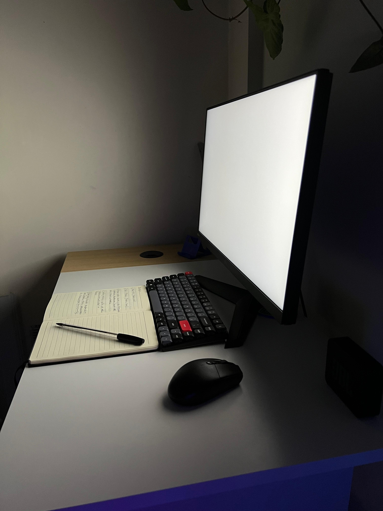

# 💡 Linterna Digital para Escritorio (Luz Cálida y Fría)

Una herramienta minimalista en Python con `tkinter` que proyecta una barra de luz cálida o fría en la parte inferior de tu pantalla. Ideal para estudiar, tomar notas o trabajar en ambientes oscuros sin necesidad de encender luces físicas.

---

## 🚀 Características

- 🔼🔽 Altura ajustable con las teclas de flecha
- ⬅️➡️ Cambia entre luz fría y luz cálida
- 🔒 Siempre visible, incluso encima de otras ventanas y la barra de tareas
- ❌ Sin bordes ni decoración de ventana
- 🧹 Cierre rápido con la tecla `Escape`

---

## 🖥️ Requisitos

- Python 3.7+
- No requiere librerías externas (usa solo `tkinter`)

---

## ▶️ Uso

1. Descargá o cloná el archivo `linterna.py`.
2. Ejecutalo con Python:

```bash
python linterna.py
```

3. Atajos de teclado:

| Tecla         | Acción                         |
|---------------|--------------------------------|
| Flecha ↑      | Aumentar altura de la barra    |
| Flecha ↓      | Reducir altura de la barra     |
| Flecha ←      | Activar **luz cálida**         |
| Flecha →      | Activar **luz fría**           |
| Escape        | Cerrar la linterna             |

---

## 🌈 Modos de Luz y Temperatura de Color

Esta linterna cuenta con dos modos visuales, que simulan temperaturas de color reales:

| Modo        | Color HEX  | Temperatura (K) | Sensación Visual                  |
|-------------|------------|-----------------|-----------------------------------|
| Luz Cálida  | `#fff4cc`  | ~3000 K         | Suave, acogedora, relajante       |
| Luz Fría    | `#ffffff`  | ~6500 K         | Clara, intensa, estilo luz día    |

> La temperatura Kelvin representa cuán "cálida" o "fría" se percibe una fuente de luz.

---

## 💾 Ejecutable para Windows

Si no querés usar Python, podés generar un `.exe` fácilmente:

### 1. Crear tu propio ejecutable

```bash
pip install pyinstaller
pyinstaller --onefile --noconsole --icon=linterna.ico linterna.py
```

Esto generará `linterna.exe` en la carpeta `dist/`.

### 2. O descargarlo ya compilado

👉 [Descargar linterna.exe](https://github.com/guzadev/linterna/releases)

---

## 📸 Vista previa

<p align="center">
  
  
  
  
</p>

---

## 📄 Licencia

MIT License — Libre para usar, modificar y compartir.  
¡Si te sirvió, dejá una estrella en el repositorio ⭐!
---

## 🖼️ Créditos de Icono

<a href="https://www.flaticon.es/iconos-gratis/linterna" title="linterna iconos">Linterna iconos creados por fjstudio - Flaticon</a>
